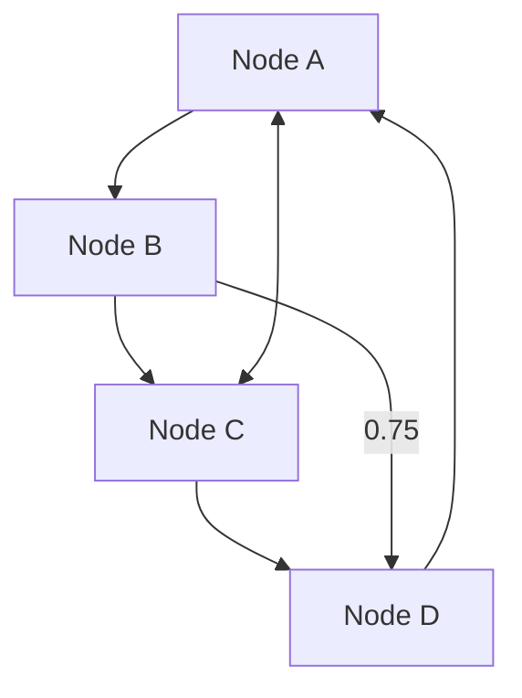

# Graph Visualization Tool

An interactive graph visualization tool built with Next.js, React, and TypeScript that parses Mermaid diagram format and allows manual node positioning, Bezier curve editing for edges, and exports publication-quality SVG graphics.

## Features

### ✅ Phase 1 - Complete

- **Mermaid Format Parser**: Parse Mermaid diagram syntax (nodes and edges) with support for directed (`-->`) and bidirected (`<-->`) edges
- **Interactive Graph Editing**:
  - Drag nodes to reposition them
  - Zoom in/out with mouse wheel
  - Pan the canvas by dragging
  - Click edges to add/edit Bezier control points
  - Drag control points to curve edges and prevent overlaps
- **Edge Annotations**: Data-driven edge labels from Mermaid input (e.g., correlation values)
- **SVG Export**: Export publication-quality vector graphics (SVG and PNG)
- **Node Customization**: Multiple shapes (circle, square, rectangle), colors, and sizes
- **Edge Customization**: Colors, widths, and styles (solid, dashed, dotted)

## Technology Stack

- **Next.js 16** - React framework with App Router
- **React 19** - UI components
- **TypeScript** - Type safety
- **Tailwind CSS** - Styling
- **SVG** - Vector graphics rendering

## Getting Started

### Installation

```bash
npm install
```

### Development

```bash
npm run dev
```

Open [http://localhost:3000](http://localhost:3000) in your browser.

### Build for Production

```bash
npm run build
npm start
```

## Usage

### 1. Input Mermaid Diagram

Enter your Mermaid diagram in the control panel. Example:



### 2. Parse and Render

Click "Parse & Render" to generate the graph. The tool uses a force-directed layout algorithm (Fruchterman-Reingold) for initial positioning.

### 3. Interactive Editing

- **Drag nodes**: Click and drag any node to reposition it
- **Curve edges**: Click an edge to show its control point, then drag the control point to adjust the curve
- **Zoom**: Scroll with mouse wheel to zoom in/out
- **Pan**: Click and drag the canvas background to pan

### 4. Customize Appearance

Use the control panel to adjust:
- Node shapes (circle, square, rectangle)
- Node colors and sizes
- Edge colors, widths, and styles

### 5. Export

Export your graph as:
- **SVG** (vector graphics for publications)
- **PNG** (high-resolution raster image, 3x scale)

## Mermaid Syntax Support

### Nodes

```mermaid
A[Label with square brackets]
B(Label with parentheses)
C{Label with curly braces}
D  # Just ID, no label
```

### Edges

```mermaid
# Directed edge
A --> B

# Bidirected edge
A <--> B

# Undirected edge
A --- B

# Edge with label/annotation
A -->|0.75| B
A -->|correlation| B
```

## Project Structure

```
graph-viz/
├── app/
│   ├── components/
│   │   ├── GraphCanvas.tsx       # Main SVG canvas with zoom/pan
│   │   ├── NodeRenderer.tsx      # Individual node rendering
│   │   ├── EdgeRenderer.tsx      # Edge rendering with Bezier curves
│   │   ├── ControlPanel.tsx      # Sidebar controls
│   │   └── ExportButton.tsx      # Export functionality
│   ├── lib/
│   │   ├── graphTypes.ts         # TypeScript type definitions
│   │   ├── mermaidParser.ts      # Mermaid format parser
│   │   ├── bezierUtils.ts        # Bezier curve calculations
│   │   └── svgExport.ts          # SVG/PNG export utilities
│   ├── page.tsx                  # Main page
│   ├── layout.tsx                # Root layout
│   └── globals.css               # Global styles
├── public/                       # Static assets
├── package.json
└── README.md
```

## Key Components

### GraphCanvas

Main component that handles:
- SVG rendering
- Zoom and pan transformations
- Mouse/touch interactions
- Node dragging
- Control point editing

### NodeRenderer

Renders individual nodes with:
- Multiple shapes (circle, square, rectangle)
- Custom colors and sizes
- Multi-line labels (split by underscore)
- Selection highlighting

### EdgeRenderer

Renders edges with:
- Quadratic Bezier curves
- Directional arrows
- Bidirectional arrows
- Edge annotations/labels
- Control point visualization

### ControlPanel

Provides UI for:
- Mermaid input and parsing
- Graph customization
- Export controls
- Usage instructions

## Algorithm: Fruchterman-Reingold Layout

The initial node positions are calculated using the Fruchterman-Reingold force-directed algorithm:

- **Repulsive forces**: All node pairs repel each other
- **Attractive forces**: Connected nodes attract each other
- **Cooling schedule**: Temperature decreases over iterations for stability
- **Iterations**: 50 iterations for convergence

This provides a reasonable starting layout that users can then manually refine.

## Future Enhancements (Phase 2+)

- [ ] Multiple layout algorithms (hierarchical, circular, etc.)
- [ ] HTML export for interactive sharing (like Plotly)
- [ ] Undo/redo functionality
- [ ] Node grouping and clustering
- [ ] Edge bundling for large graphs
- [ ] Animation and transitions
- [ ] Save/load graph state
- [ ] Keyboard shortcuts
- [ ] Touch gestures for mobile
- [ ] Additional node shapes (diamond, ellipse, etc.)
- [ ] Curved text along edge paths
- [ ] Grid snapping for precise alignment

## Reference Implementation

This implementation was inspired by the existing vanilla JavaScript prototypes found in:
- `both_cg_1000_2_interactive.html`
- `test.html`

Key improvements:
- Modern React architecture
- TypeScript type safety
- Bezier curve support (was straight lines)
- Better separation of concerns
- Improved interaction model
- Publication-quality SVG export

## Contributing

This project was developed as a research tool for visualizing discovery algorithm outputs. Feedback and contributions are welcome!

## License

MIT

## Acknowledgments

- Meeting participants: Eric, Brian, Anirudh Vasudevan, and Arev
- Inspired by: Tetrad, LaTeX vector graphics, and Plotly interactive exports
# GraphViz
